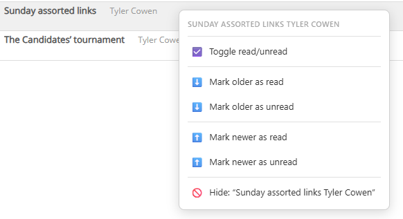
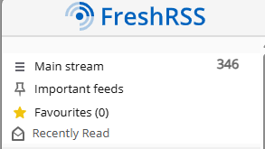
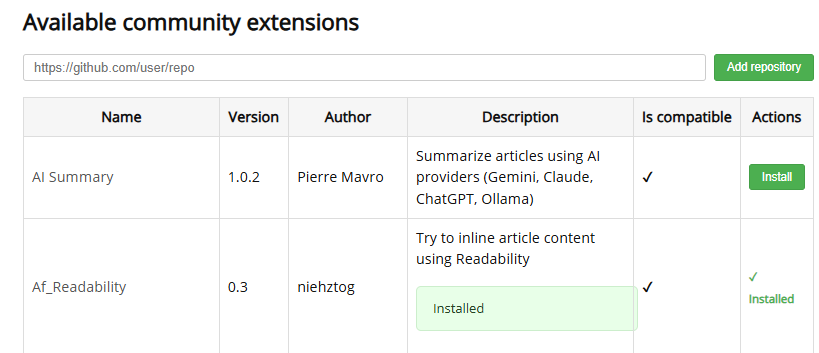

# FreshRSS Extensions

Custom extensions for [FreshRSS](https://freshrss.org) that fix everyday annoyances — scroll jumps, missing context menus, manual page refreshes, and no way to install extensions without SSH.

**Requirements:** FreshRSS 1.20+ (uses `js_vars` hook and `registerController`). No external dependencies.

## Extensions

### Sticky Reader

Fixes the jarring scroll jumps when switching between articles. Keeps the toolbar visible, shows which feed you're reading, and hides the redundant feed column in single-feed view.

- Scroll anchoring — clicked article stays where you clicked it
- Sticky toolbar — nav controls don't scroll away
- Feed name in toolbar — always know what you're reading
- Locked sidebar (optional) — independent scroll for sidebar and content
- Configurable scroll target (search bar, control bar, or title row)

### Right-Click Actions

Context menus on articles, feeds, and categories. Four zones (article header, article body, sidebar feed, sidebar category) with per-zone action toggles.

Article actions: toggle read/star, open in tab, mark older/newer as read, add permanent title filter.
Feed actions: mark all read/unread, recently read, open settings.
Category actions: mark all read/unread, expand/collapse, manage subscriptions.

### Silent Refresh

Updates sidebar unread counts via the FreshRSS JSON API without reloading the page. Configurable interval (1-60 minutes) and title bar mode (all unread vs. current view).

### Recently Read

Adds a "Recently Read" link to the sidebar that filters to articles you've already read, sorted by when you last interacted with them.

### Extension Manager

Install, update, and remove FreshRSS extensions without SSH or file access. Add GitHub repository URLs as extension sources, browse available extensions, and install individually. Uses atomic updates with automatic rollback on failure.

## Installation

### Option 1: Install Extension Manager first (recommended)

1. Download this repo as a zip (Code → Download ZIP)
2. Extract `xExtension-ExtensionManager` to your FreshRSS `extensions/` directory
3. Enable Extension Manager in FreshRSS settings → Extensions
4. Configure an install mode — see [Extension Manager README](xExtension-ExtensionManager/README.md#install-modes)
5. Use Extension Manager to install the remaining extensions by pasting this repo's URL

### Option 2: Manual

Copy any `xExtension-*` directory into your FreshRSS `extensions/` directory, then enable in settings.

The extensions directory is typically at:
- Docker: `/var/www/FreshRSS/extensions/` (inside the container)
- Manual install: `<freshrss-root>/extensions/`

## Configuration

Each extension has its own settings page in FreshRSS (Extensions → Configure). No global configuration file needed.

## Contributing

Contributions are welcome. See [CONTRIBUTING.md](CONTRIBUTING.md) for development setup and code style.

## Support

If these extensions are useful to you, [buy me a coffee](https://buymeacoffee.com/featurecreep).

## License

[MIT](LICENSE)
